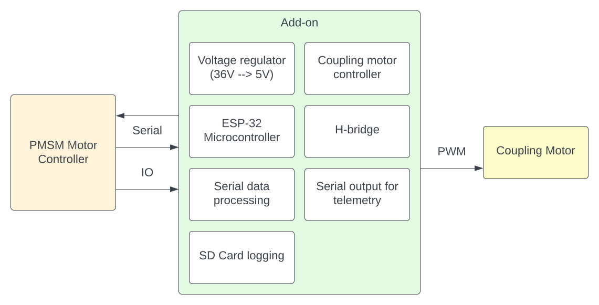
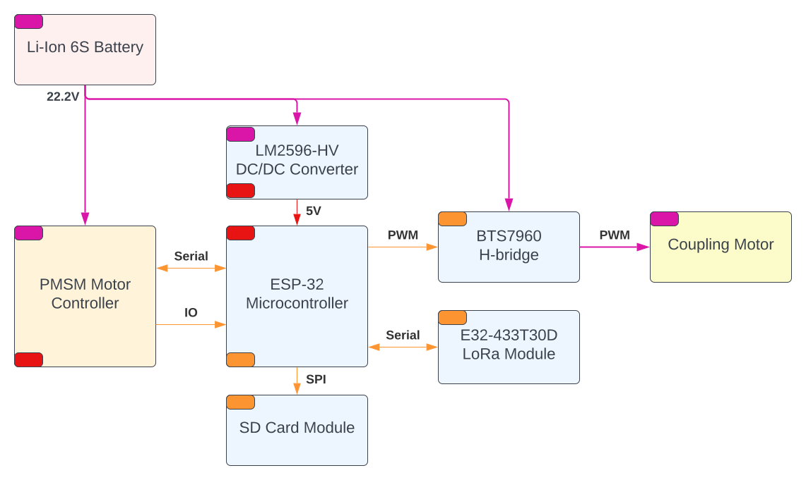

# Add-on para Controlador do Motor PMSM da Equipe EcoMauá

Plano de Desenvolvimento Geral -- (31/03/2024)

<!-- ver:0.1.0 -->

## Introdução 
<!-- sec:introduction -->

Este documento se dedica a ser um plano de desenvolvimento para a um _add-on_ do controlador de motor PMSM atualmente utilizado pela equipe estudantil EcoMauá nos veículos elétricos.

O responsável pelo desenvolvimento são os alunos da equipe EcoMauá.

O orientador do trabalho é o professor Rodrigo de Marca França, orientador da parte elétrica da equipe EcoMauá.

## Autoria do Documento
<!-- sec:document_authorship -->

1. Rodrigo França ([rodrigo.franca@maua.br](rodrigo.franca@maua.br)).

## Add-on do Controlador de Motor PMSM

### Período de Desenvolvimento

-  **Início:** 01/04/2024

-  **Término:** 01/05/2024

### Descritivo

Sistema capaz de ampliar as funcionalidades do atual controlador de motores PMSM utilizado pela equipe EcoMauá para o novo veículo elétrico da equipe, denominado de Caixão. 

O sistema deve permitir o controlador atual realizar o controle do sistema de acoplamento, assim como facilitar o envido de telemetria a longa distância (por rádio ou Wi-Fi) ou por Bluetooth para curtas distancias. Também deve permitir a _log_ de informações em uma memória não volátil, como um cartão SD.

A justificativa por esse trabalho vem do fato de ser necessário para o novo veículo adicionar capabilidades para o controlador já testado e validado em competições passadas.

### Requerimentos Funcionais

1. Ser um módulo completamente independente do controlador atual de motores PMSM.

2. Adicionar funcionalidades para o controlador atual de motores PMSM.

3. Ter uma unidade de controle rápida e eficiente, com suporte a Bluetooth e Wi-Fi.

4. Receber e processar dado (brutos) de telemetria por serial do controlador atual de motores PMSM.

5. Envio de dados (processados) de telemetria por Bluetooth, Wi-Fi ou serial (para comunicação de rádio e similares).

6. Receber comandos por interface de IO do controlador de motor atual.

7. Acionar o motor de acoplamento através de uma ponte-h conforme necessidade.

8. Realizar o _log_ de informações em uma memória não volátil (cartão SD).

9. Ter o seu próprio regulador de tensão.

### Requerimentos Não-Funcionais

Nenhum requerimento não-funcional.

### Diagrama de Blocos

O diagrama de blocos proposto para o sistema pode ser visto na Figura \ref{fig:diag_blocos_sistema}.

<!-- fig:diag_blocos_sistema -->

### Módulos de Hardware do Sistema

- Regulador de tensão CC/CC LM2596-HV, ajustado para 5 V de saída.

- Microcontrolador ESP-32 para controle do sistema.

- Modulo de cartão SD ou micro-SD para _log_ das informações.

- Modulo ponte-h BTS7960 para acionamento do motor de acoplamento.

- Modulo de rádio LoRa E32-433T30D operando em 433 MHz e com 1 W de potência para telemetria de longa distância.

O diagrama de módulos de hardware e conexões do sistema pode ser visto na Figura \ref{fig:diag_modulos_hardware_sistema}.

<!-- fig:diag_modulos_hardware_sistema -->

### Características Técnicas do Sistema

TBD

### Proposta de Desenvolvimento

TBD

### Fluxo de Dados do Sistema

TBD
