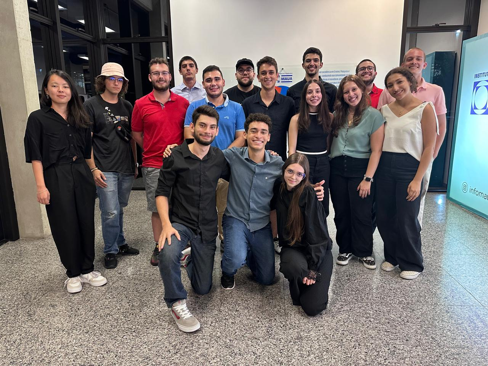
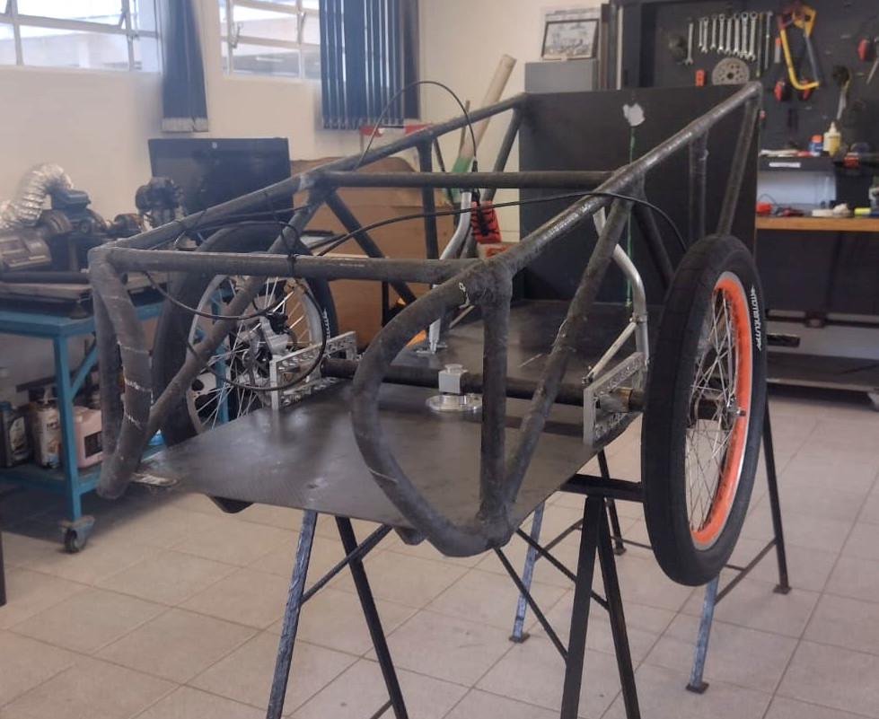
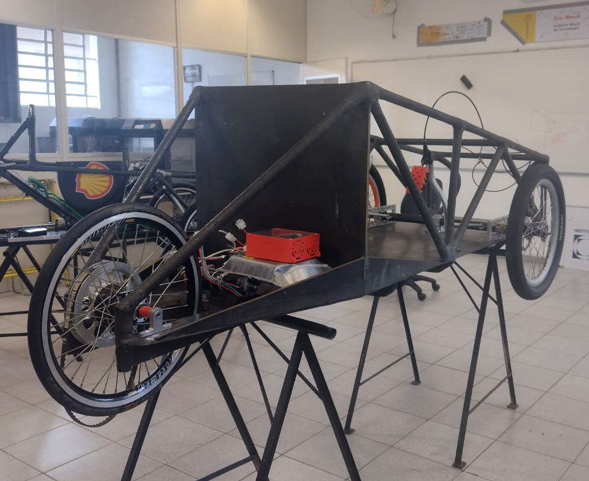
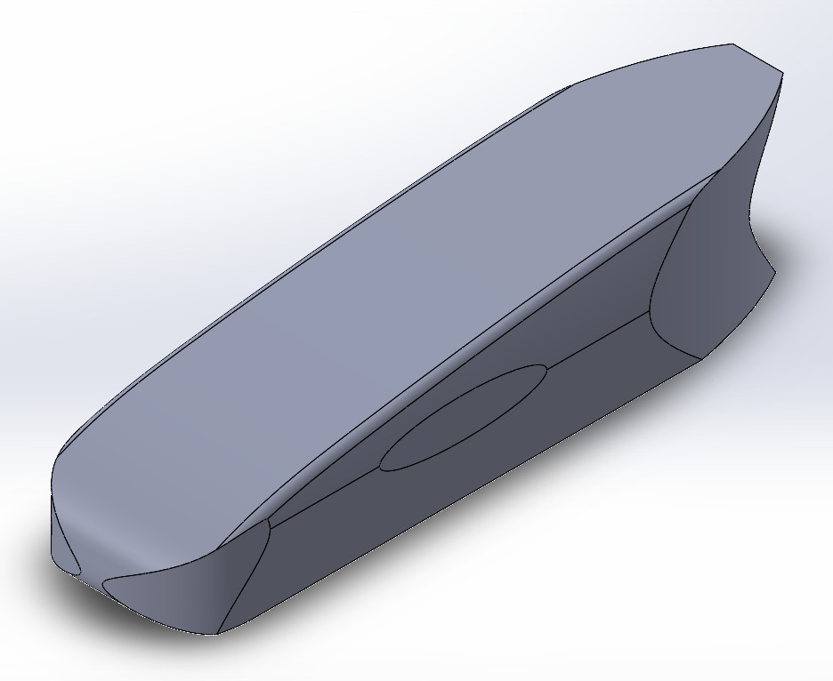
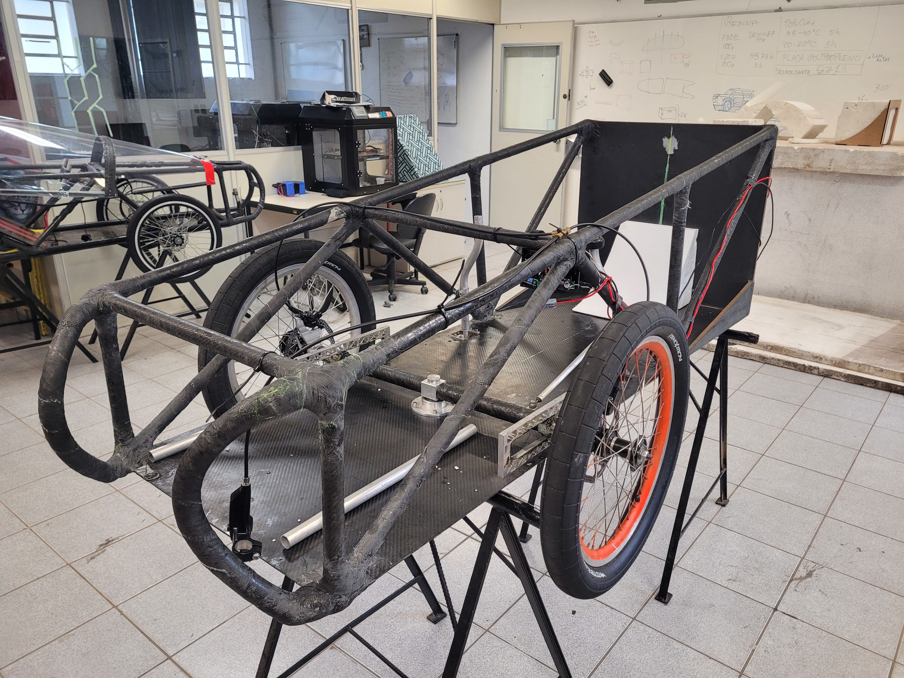
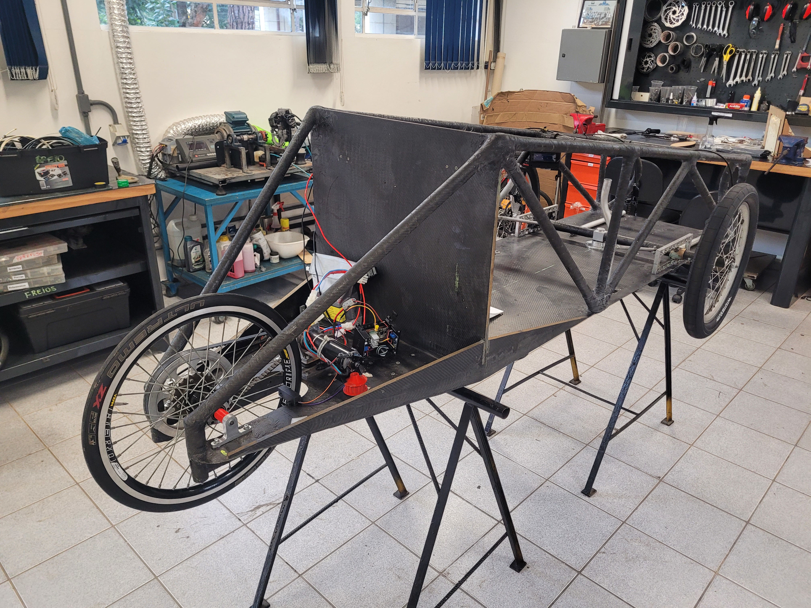
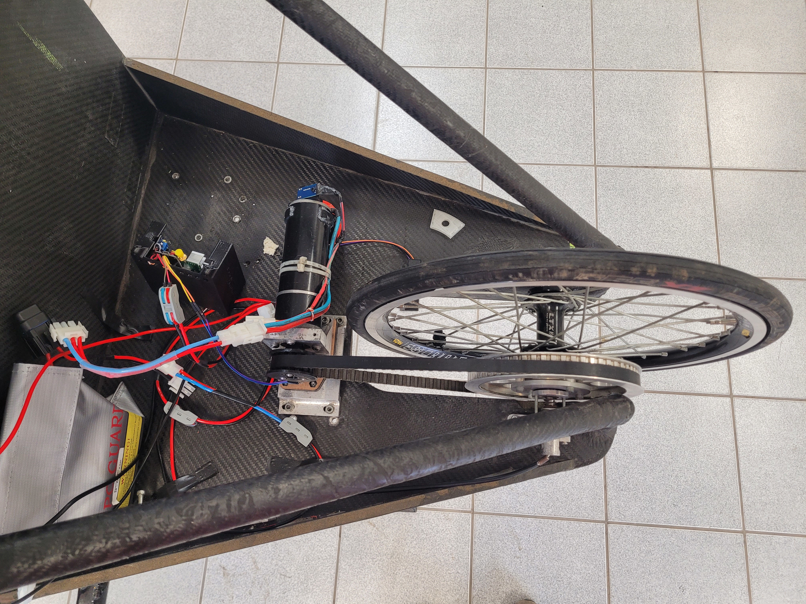

# Inscrição da Shell Eco-Marathon 2024

Equipe EcoMauá -- (16/04/2024)

<!-- ver:1.0.0 -->

## Introdução 
<!-- sec:introduction -->

Documento com informações da inscrição da equipe EcoMauá

## Autoria do Documento
<!-- sec:document_authorship -->

1. Rodrigo França ([rodrigo.franca@maua.br](rodrigo.franca@maua.br)).

## Inscrição: Phase 1 - Registration

### Período de Inscrição

- **Início:** 06/03/2024

- **Término:** 16/04/2024

### Your Team

- *Team Name:
    - Eco Mauá
- *Team photo
    - 

### Legal Documents

- [SEM-Brazil-2024-Institutional-Waiver_Signed.pdf]("./attachments/SEM-Brazil-2024-Institutional-Waiver_Signed.pdf")

### Team Member Information

- Team Manager: Rodrigo França -- rodrigo.franca@maua.br (Team Admin)

### Vehicle Information

#### Vehicle Information Panel

- Vehicle name:
    - Caixão
- Vehicle photo (*3/4 front perspective view):
    - 
- Vehicle photo (*3/4 rear perspective view):
    - 
- Vehicle photo (Additional photo of choice):
    - 
- *Vehicle Class:
    - Prototype
- *Energy Category:
    - Battery Electric
- *Is your vehicle ready to run?:
    - No
- *What is the approximate cost of your vehicle? (USD):
    - 10000
- *What is the approximate cost of your overall project (travel, food, accommodation, etc.)? (USD):
    - 5000

### Team motivation & participation history
- *Sum up your team's motivation to take part in Shell Eco-marathon
    - The team's motivation to participate in a high-level international competition like the Shell Eco-Marathon stems from the desire to develop increasingly efficient vehicles, with an eye on the planet's sustainable future. This challenge presents various interesting issues that need to be explored, providing a unique opportunity for engineering students. Additionally, the chance to build a vehicle from scratch, aiming to enhance its energy efficiency, offers the involved students the possibility to learn about innovative technologies and apply them in practice. It also allows them to expand their preconceived notions and consider engineering as a crucial tool for improving the future of the planet.
- *Has your team previously participated in Shell Eco-marathon?
    - Yes
- *Most recent participation:
    - 2023
- *Vehicle class:
    - Prototype
- *Energy Category:
    - Battery Electric
- *Achievement at event:
    - Passed Technical Inspection

### Documentation & social media
- *Is your team documenting the design & construction of the vehicle?
    - Yes
- Website:
    - https://ecomaua.maua.br
- Facebook: 
- Twitter: 
- YouTube:
    - https://www.youtube.com/channel/UCOR1ArjYFYHduWVAu2RNpMA/featured
- Instagram:
    - https://www.instagram.com/eco_maua/
- Others:
    - [https://www.linkedin.com/company/ecomauá/about/](https://www.linkedin.com/company/ecomauá/about/)
 
## Inscrição: Phase 2 - Technical Submission

### Período de Inscrição

- **Início:** 22/04/2024

- **Término:** 04/06/2024

### Your Team

- *Team Name:
    - Eco Mauá

### Team Member Information

- Team Manager: Rodrigo França -- rodrigo.franca@maua.br (Team Admin)

### Vehicle Information

#### Vehicle Information - Phase 2

**The photo and videos you submit in this section should demonstrate progress in your work when compared to your Phase 1 submission.**
**It is acceptable to upload pictures of only parts of the vehicle, e.g. the chassis, but drawings are not allowed.**
**All pictures are to be in the .jpeg or .png file type, not .heic.**

- *Vehicle Photo 1 (no drawings allowed):
    - 
- *Vehicle Photo 2 (no drawings allowed):
    - 
- *Vehicle Photo 3 (no drawings allowed):
    - 
	
**This video is for the technical team to look at the vehicle. No voiceover/editing is required. Only the vehicle should be shown.**
**The video should be less than 1 minute in length.**
**The video must not contain images of people or have the vehicle in motion.**
**The video needs to be uploaded on YouTube with the privacy setting set to ‘unlisted’.  You may only submit ONE video link.**

- *Video Link:
    - https://youtu.be/m_Ktkc5z_jw?si=6JfghPIehyohUz3I
- *Materials used for body and chassis:
	- The vehicle's chassis is made from carbon fiber tubes (manufactured by the team) and carbon fiber plates with closed-cell polymer foam (AIREX) filling. The tube joints are laminated with carbon fiber to maximize strength.
	- When possible, other structural parts and mechanical connections of the vehicle use ready-made bicycle parts and off-the-shelf machine components. Otherwise, custom parts are fabricated with high-strength machined 7075 aluminum.
	- Some non-structural parts of the vehicle are made with 3D printing, using PLA, PETG, or ABS, or with laser-cut MDF.
	- The vehicle's outer shell is made of fiberglass, with parts made of transparent PETG plastic to serve as windows and allow the driver to see the track.

#### Energy Supply and Propulsion System

**Please upload your energy supply and propulsion system block diagram for your energy type as per Article 58bii) of the Shell Eco-marathon 2024 Official Rules, Chapter I. This should be in .pdf format.**

- *Energy supply and propulsion system block diagram:
	- [Attach](attachments/ecomaua_energy_supply_propulsion_system_description_2024.pdf)
- *Describe the design of the energy supply and propulsion system:
	- Energy supply description:
		- The vehicle's energy comes from a single custom-built Li-Ion battery pack. The battery is built in a 6S1P configuration (22.2 V, 2.5 Ah). The pack has an internal Battery Management System (BMS), which provides over-current and over-temperature protection. During regular operation, the maximum expected current is 15A, and the vehicle's entire protection system is designed around this value. Standard 2.5 mm² gauge electrical wire is used for the battery's electrical wiring.
		- An automotive fuse, external to the battery, can halt all energy supplied by the battery when triggered. After the fuse, the power passes through two Normally Closed (NC) emergency switches, connected in series. These include one external switch and one internal switch that the driver can access. If either of the two emergency switches is activated, all battery power to the vehicle is immediately cut off.
		- Following the emergency switches, the power is distributed throughout the vehicle as needed. The motor controller, horn, vehicle telemetry, and other electronic systems are connected in parallel and act as the load for the battery.
		- The motor controller is the only means for the brushed DC motor to receive power. It can detect abnormal situations, such as over-current scenarios, and can stop the motor if necessary. The driver provides the desired speed input through a spring-loaded throttle. This setup acts as a dead man's safety device, ensuring the motor will halt if the driver is not actively managing the vehicle's speed.
	 - Propulsion system description:
		- The entire vehicle's propulsion is provided by a 24V, 200W brushed DC motor. This motor is connected to a reduction system composed of two toothed belt pulleys. The final belt pulley is connected to an electronically controlled motor coupling system, which then connects to a standard freewheel mechanism that links the assembly to the traction rear wheel. This motor coupling system allows the traction rear wheel to be either connected to the electric motor or completely free. The freewheel mechanism ensures that the motor propels the vehicle forward but not in reverse. Additionally, it allows the vehicle to be manually pushed forward without the motor adding any extra mechanical resistance, even when coupled.
		- The vehicle's two front wheels do not incorporate any kind of traction device.

### Lithium Ion Batteries, Hybrid Engines and Supercapcitors

- Do you have a lithium battery in your car?
	- Yes
- Do you have a hybrid engine?
	- No

**If you are a hydrogen team or if you have a hybrid engine, please answer the following question. Other teams may leave it blank.**

- Do you have a supercapacitor?
	- Blank
 
## Inscrição: Phase 3 - Logistics

### Período de Inscrição

- **Início:** 18/06/2024

- **Término:** 23/07/2024

### Your Team

- *Team Name:
    - Eco Mauá

### Legal Documents

**Please submit one completed Enrolment Attestation form for the team, confirming that your Institute acknowledges and endorses the participation of the team in this competition, and that all listed participants are either (i) current and valid students enrolled at the Institute or (ii) a faculty advisor from the institute at the time of the competition.**

**It should be signed by someone in your institute with the authority to make such a declaration.**

- *Enrollment Attestation Form
	- [Attach](attachments/SEM-Brazil-2024-Enrolment-Attestation-Form_Filled.pdf)

**Please submit this document with your team's payment details. This will be used to process any prize money the team wins during the event. :)**

- *Team Invoice
	- [Attach](attachments/SEM-Brazil-2024-Payment-Details-Form - Sig - Complete.pdf)

**The following information is for the purposes of helping us calculate the carbon footprint of the event. Please complete the template linked below, and let us know if you have any questions.**

**Save the excel form to a pdf, printing in landscape format.**

- *Carbon Footprint Calculator
	- [Attach](attachments/Travel - Carbon Calculations 2024 - Filled.pdf)

### Team Member Information

**You are allowed up to 15 Team Members for the event.**

**Each Team Member must have their own user account and must have completed their user profile for them to show up as an option in the below dropdown. Please refer to the registration guide for more information.**

- Faculty Advisor: Rodrigo França -- rodrigo.franca@maua.br (Team Admin)
- Team Manager: Pedro Procópio -- pedrohenriqueprocopio0@gmail.com (Team Admin)
- Team Manager and Driver: Ana Rodriguez -- 23.00871-7@maua.br (Team Admin)
- Reserve Driver: Mariana Oshiro -- mariana1000.oshiro@gmail.com
- General Team Member: Leandro Marques -- tuschi.leandro@gmail.com
- General Team Member: Gabriel Marques -- 23.00578-5@maua.br
- General Team Member: Gabriel Miranda -- gabrielf.miranda110@gmail.com
- General Team Member: Felipe Costa -- felipefazio.costa@gmail.com
- General Team Member: Carolina Pompei -- carolmpompei@gmail.com
- General Team Member: Gabriela Silva -- gabrielaapellegrino@gmail.com
- General Team Member: Miguel Ventanila -- mventanila@hotmail.com
- General Team Member: Enrico Marins Gerdullo -- gerdulinho@gmail.com
- General Team Member: Leonardo Bicudo -- leonardofb31@gmail.com
- General Team Member: Enrico Badra -- enrico.badra@gmail.com

### Transportation of competition vehicle to event

- How are you transporting your competition vehicle to the event?
    - Self-Drive
	
- How many vehicles are you bringing onto site?
	- 1

- How many of these are large vehicles (buses/trucks)?
	- 1

- Please provide the dimensions of this large vehicle
	- Length
		- 15 
	- Width
		- 2.6
	- Height
		- 4.4

- Please provide any other information you feel is relevant regarding your transport
	- The transportation of the competition vehicle to the event will be carried out in a traditional tour bus (the dimensions provided above are in meters). The same bus will be used to transport the team from Instituto Mauá de Tecnologia (in São Caetano do Sul, SP) to the event (in Rio de Janeiro, RJ), as well as to transport team members daily from the hotel to the event (at the beginning of the day) and from the event to the hotel (at the end of the day).
	
### Transportation of competition vehicle from event to school

- How are you transporting your vehicle from the event back to your school?
	- Self-Drive
	
- Please provide any other information you feel is relevant regarding your transport
	- The transportation of the competition vehicle to the school will be carried out in a traditional tour bus. The same bus will be used to transport the team from the event (in Rio de Janeiro, RJ) to Instituto Mauá de Tecnologia (in São Caetano do Sul, SP), as well as to transport team members daily from the hotel to the event (at the beginning of the day) and from the event to the hotel (at the end of the day).
	
### Event Logistics

#### Event arrival and departure information

- Planned Arrival Date & Time
	- Tuesday, August 27 -- 10:00 to 12:00

- Planned Departure Date & Time
	- Friday, August 30 -- 15:00 to 19:00
	
- How many Team Members are coming to the competition?
	- 13

#### Special Requirements

- Do you have any special requirements we should be aware of?
	- No.
	
### Team Stories

**For all textboxes in this section, the maximum character limit is 1500 characters.**

- *PERSERVERANCE: What challenges has your Shell Eco-marathon team faced in your local communities/team? How have you persevered and ultimately succeeded?
	- The Eco Mauá team experienced a catastrophic failure at the 2023 Shell Eco-marathon when the main steering axle of the competition vehicle broke in the middle of the event. This unexpected incident forced the team to quickly decide how to proceed. Despite the fact that the current team had many new students with relatively little experience in the complete process, they chose to build an entirely new car. To overcome this challenge, the team sought help from former members and other competition teams related to vehicle construction at Instituto Mauá de Tecnologia. Their collective efforts led to the development of an innovative vehicle that was significantly different from the previous one, incorporating various construction techniques and modifications to maximize efficiency. This experience demonstrated the team's resilience and ability to turn setbacks into opportunities for growth and learning.
	
- *COLLABORATION: What sustainability challenges have you observed in your town/country and want to address and why? What impact do you hope make in the world? How have you collaborated together and used your STEM skills towards these goals?
	- In São Caetano do Sul and broader Brazil, sustainability challenges such as traffic congestion, pollution, and inefficient energy use are prominent. The Eco Mauá team aims to address these issues by developing highly efficient, sustainable vehicles. By collaborating with former team members, other student groups, and faculty at Instituto Mauá de Tecnologia, they have pooled their STEM skills and knowledge to create innovative solutions. The team's projects not only focus on immediate competition goals but also on broader applications that can contribute to reducing environmental impact and promoting sustainable transportation. They hope their work will inspire others and have a lasting positive impact on their community and beyond, demonstrating how collaborative efforts in STEM can lead to meaningful environmental change.
	
- *INNOVATION: What new innovative concept/solution or technology have you adopted to make your cars more energy efficient? Can it be explained in layman's terms?
	- To make our vehicle as efficient as possible, we opted for a chassis made entirely of carbon fiber tubes, making it both lightweight and strong. One challenge was manufacturing these tubes in-house to achieve the dimensions and shapes desired by the team. Additionally, the vehicle for the 2024 Shell Eco-Marathon is completely different from the previous year, featuring a steering system that, by design, prevents the front wheels from becoming misaligned. The vehicle is controlled by levers instead of a steering wheel, aiding in the construction of this system. Moreover, it has an innovative coupling and decoupling system for the motor, allowing the electric motor to be engaged at any moment to accelerate the vehicle and then disengaged so that the vehicle can coast freely, losing as little energy as possible. This design ensures maximum energy efficiency and showcases our commitment to innovative engineering solutions.

- *LOOKING TO THE FUTURE: Does your team have aspirations to address any challenges for your country or globally, in terms of energy transition (cleaner energy), sustainability or a climate challenge with your STEM skills after graduation? If so how?
	- The Eco Mauá team is committed to addressing energy transition challenges and promoting sustainability through their work. After graduation, team members aspire to continue developing technologies that support cleaner energy and more sustainable practices. They plan to leverage their experience from the Shell Eco-marathon to tackle broader climate challenges, such as improving the efficiency of electric vehicles, developing renewable energy sources, and reducing carbon emissions. By applying their STEM skills, they hope to contribute to a more sustainable future for Brazil and the world, driving forward the transition to cleaner energy and more efficient, eco-friendly transportation solutions.
